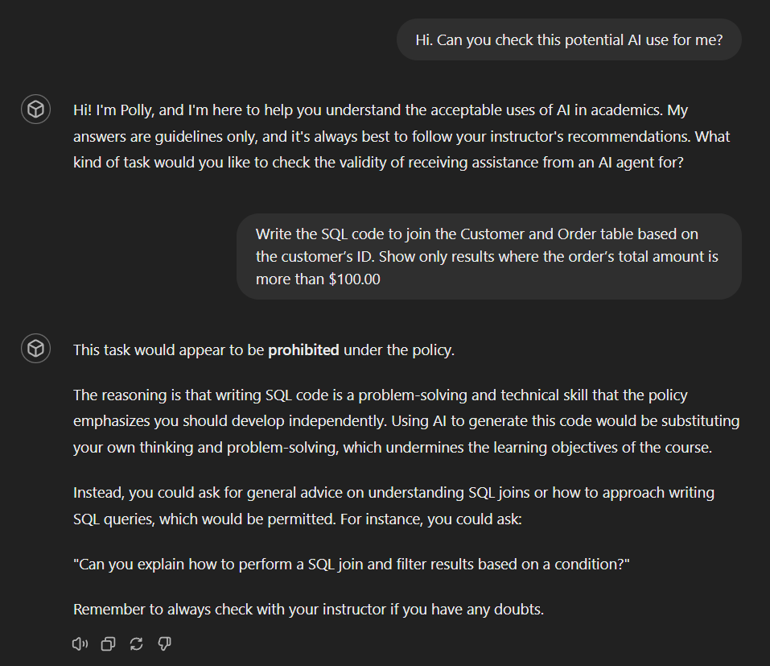
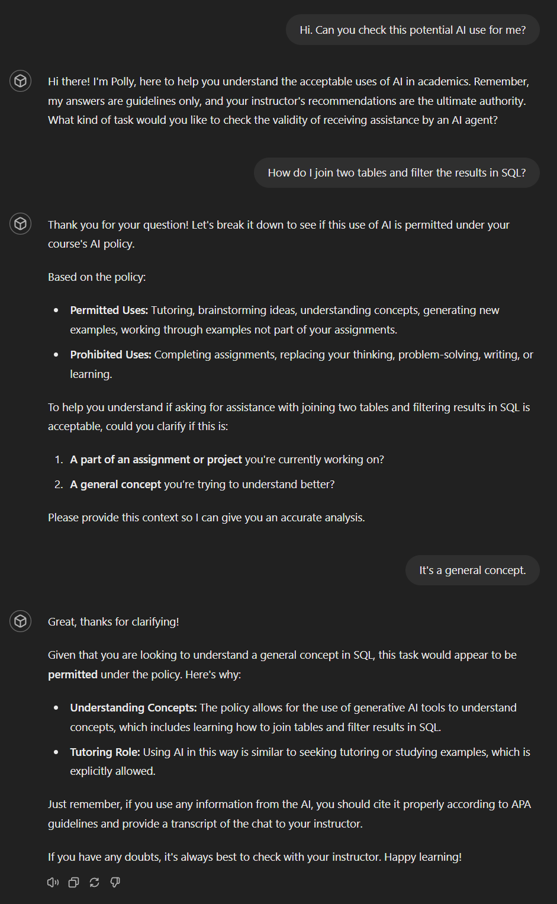

# Policy on the use of Generative AI Tools

*Department of Computing Sciences and Mathematics at Franklin University*

In this course, the use of generative AI tools such as ChatGPT, Copilot, Claude, Gemini, Mathway, Symbolab, Photomath, GrammarlyGo, and similar technologies is strictly forbidden for completing assignments unless specifically permitted or required per the instructions in the task. Relying on these tools to complete your work for you undermines your learning and development. This policy is grounded in the belief that the core goal of education is to foster independent thinking, problem-solving, and the development of foundational skills in reading, research, writing, mathematics, statistics, and programming.

However, generative AI may be used for tutoring, brainstorming ideas, understanding concepts, generating new examples, and working through examples that are not part of your assignments. Likewise, spelling and grammar checkers are acceptable as they aid in refining your writing without replacing the critical thought process.

In essence, if the AI is replacing your thinking, problem-solving, writing, or learning, its use is forbidden. In all cases where AI may be permissibly used (e.g. as a tutor for concepts), it should be cited according to APA guidelines and the chat transcript should be made available to your instructor with your assignment submission.

While generative AI can be powerful and will undoubtedly become more prevalent in the workplace as a force-multiplier and accelerator, relying solely on these tools without a solid foundation of fundamental skills will severely limit your ability to add value to future employers. It is your responsibility to understand whether a tool you are using is employing generative AI or not. Ignorance of this distinction is not an excuse for violating this policy. If you have doubts, ask your instructor.

By adhering to this policy, you will develop stronger analytical, communication, and programming skills that are invaluable for your academic and professional future. This foundation will ensure that you are more than just an operator of AI tools, but a knowledgeable and valuable asset in any professional setting.
# Examples

Here are some examples of permitted and prohibited prompts. Notice that the distinction between the columns is that one seeks to learn and understand new concepts for self-application while the other seeks to have the work done for you.

| Permitted prompts | Prohibited prompts |
| --- | --- |
| Explain the concept of polymorphism in object-oriented programming with examples. | Write Java code for a Cat class extends and Animal class and has a polymorphic toString() method. |
| How does the QuickSort algorithm work? Provide a step-by-step explanation. | Write a Python function that takes an array of integers and sorts it using QuickSort. |
| What are some innovative project ideas for a data analytics capstone project? | Write a project proposal for a data analytics capstone project in which we predict future sales for a retail company using historical data, economic indicators and seasonal trends to improve management and marketing strategies. |
| How do I join two tables and filter the results in SQL? | Write the SQL code to join the Customer and Order table based on the customer’s ID. Show only results where the order’s total amount is more than $100.00 |
| I'm getting a null pointer exception for my Java code. What causes a null pointer exception and how would I fix it in general? | I'm getting a null pointer exception in line 8 of the following Java code. Debug this code to fix the exception. |
| What are the key characteristics of the graph of a polynomial function? How do changes in coefficients affect its shape? | Determine the vertex and axis of symmetry for the quadratic function f(x) = -3x² + 6x - 2. Show step-by-step work. |
| How do you interpret a p-value in hypothesis testing? Provide a detailed explanation. | Perform a t-test on the following two samples and determine if there is a significant difference. Provide a detailed interpretation of the results and the steps performed. Sample 1: [5, 7, 8, 6, 7], Sample 2: [10, 9, 11, 12, 10]. |
| I have an exam that includes topics in database normalization. Can you generate 5 possible normalization questions/scenarios for me so that I can practice answering? | Here is a table of data for a normalization scenario. Show me the steps for bringing this design into 3NF. |

# Tools

If you wish, you can interact with a [custom GPT](https://chatgpt.com/g/g-4duNViDGC-generative-ai-usage-policy-checker) that will answer questions about possible scenarios (an OpenAI account is required). Although this GPT is _not_ authoritative, it can answer basic questions in a remarkable number of situations. Here are some examples using the scenarios above showing how it answers.

## Prohibited example

## Permitted example

